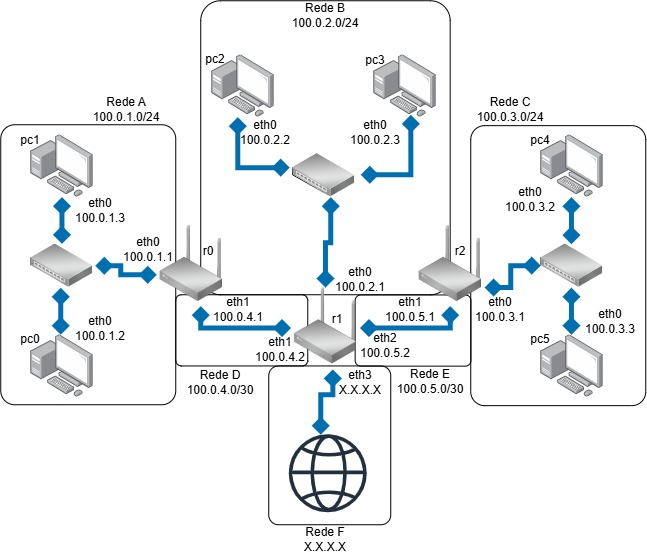

# Serviços e Protocolos de Rede (Projeto-Alex)
> Feito para windows

* ### Necessário para rodar:
    - [WSL Latest](https://github.com/microsoft/WSL/releases "Releases do WSL") instalado
    - [Kathara](https://www.kathara.org/download.html "Página de download") instalado
    - [Docker desktop](https://docs.docker.com/desktop/ "Downloads no final da página") aberto
    - Rode o seguinte comando no terminal:<br>
          "``` .\pastas.bat ```"
      > Isso ira criar as pastas necessárias para o funcionamento da rede

* ### Inicialização:
    - Ainda no cmd da pasta clonada, utilize "```kathara lstart```" para iniciar a emulação
      > Após iniciá-la, use "```kathara list```" caso queira mais detalhes sobre a emulação

* ### Testes:
    - Todas os computadores e roteadores estão conectados entre si:
        - Utilize ```ping [ip da máquina]``` para testar essas conexões
          > O roteador ```r1``` tem uma "ponte" para se conectar com a internet real, você pode pingar ips reais utilizando qualquer uma das máquinas presentes na emulação
        - Utilize ```traceroute [ip da máquina]``` para ver o caminho que o pacote precisa tomar para que chegue em outra máquina

### Topologia:



[Topologia no Draw.io](https://drive.google.com/file/d/1F4HwcEQ3NwNYMbyzlM4rQEI22stLY6X0/view?usp=drive_link)

### Tabela de Rede:
| Rede | Prefixo | Dispositivo | Interface | Endereço IP | Função |
| :---: | --- | :---: | :---: | --- | --- |
| A | 100.0.1.0/24 | r0 | eth0 | 100.0.1.1 | Gateway |
| A | 100.0.1.0/24 | pc0 | eth0 | 100.0.1.2 | Host |
| A | 100.0.1.0/24 | pc1 | eth0 | 100.0.1.3 | Host |
| B | 100.0.2.0/24 | r1 | eth0 | 100.0.2.1 | Gateway |
| B | 100.0.2.0/24 | pc2 | eth0 | 100.0.2.2 | Host |
| B | 100.0.2.0/24 | pc3 | eth0 | 100.0.2.3 | Host |
| C | 100.0.3.0/24 | r2 | eth0 | 100.0.3.1 | Gateway |
| C | 100.0.3.0/24 | pc4 | eth0 | 100.0.3.2 | Host |
| C | 100.0.3.0/24 | pc5 | eth0 | 100.0.3.3 | Host |
| D | 100.0.4.0/30 | r0 | eth1 | 100.0.4.1 | Roteador |
| D | 100.0.4.0/30 | r1 | eth1 | 100.0.4.2 | (?) |
| E | 100.0.5.0/30 | r2 | eth1 | 100.0.5.1 | Roteador |
| E | 100.0.5.0/30 | r1 | eth2 | 100.0.5.2 | (?) |

### To do:
* #### Implementar Serviço DHCP
    > (ex.:  dnsmasq, isc-dhcp-server, udhcpd, keadhcp etc.)
