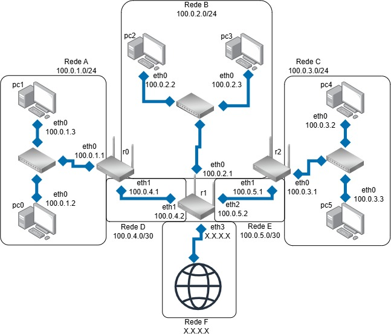

# Serviços e Protocolos de Rede (Projeto-Alex)
> Feito pensando no windows <br>
> Quando houver "```[ ]```" deve-se mudar o que está escrito dentro, sem os colchetes

* ### Necessário para rodar:
    - [WSL Latest](https://github.com/microsoft/WSL/releases "Releases do WSL") instalado
    - [Kathara](https://www.kathara.org/download.html "Página de download") instalado
    - [Docker desktop](https://docs.docker.com/desktop/ "Downloads no final da página") aberto
    - Abrir a pasta clonada no terminal e rodar os seguintes comandos:
      > Pode ser no VS Code
    1. "``` docker pull kathara/dnsmasq ```"
        > Adiciona a imagem do dnsmasq ao docker
    2. "``` docker run -tid --name [nome para a imagem, minusculo e sem espaço] kathara/dnsmasq ```"
    3. "``` docker exec -ti [nome da imagem] bash  ```"
    4. "``` apt update ```"
    5. "``` apt install dnsmasq -y ```"
    6. "``` exit ```"
    7. "``` docker commit [nome da imagem] kathara/[nome da imagem] ```"
        > Cria uma nova imagem personalizada do dnsmasq feita para esse projéto
    8. "``` assets\pastas.bat ```"
        > Isso ira criar as pastas necessárias para o funcionamento da rede
    - Va no arquivo [lab.conf](lab.conf#28) e troque o nome "lsort2" para o nome da sua imagem

* ### Inicialização:
    - Ainda no cmd da pasta clonada, utilize "```kathara lstart```" para iniciar a emulação
      > Após iniciá-la, use "```kathara list```" caso queira mais detalhes sobre a emulação

* ### Testes:
    - Todas os computadores e roteadores estão conectados entre si, utilize ```ping [ip da máquina]``` para testar essas conexões
    - Utilize ```traceroute [ip da máquina]``` para ver o caminho que o pacote precisa tomar para que chegue em outra máquina
        > O roteador ```r1``` tem uma "ponte" para se conectar com a internet real, você pode pingar ips reais utilizando qualquer uma das máquinas presentes na emulação (Ex: ping 8.8.8.8)

### Topologia:



[Topologia no Draw.io](https://drive.google.com/file/d/1VmfeN-nekgfoUXPC743uDqxRmteQUrfC/view?usp=sharing)

### Tabela de Rede:
| Rede | Prefixo | Dispositivo | Interface | Endereço IP | Função |
| :---: | --- | :---: | :---: | --- | --- |
| A | 100.0.1.0/24 | r0 | eth0 | 100.0.1.1 | Gateway |
| A | 100.0.1.0/24 | pc0 | eth0 | 100.0.1.2 | Host |
| A | 100.0.1.0/24 | pc1 | eth0 | 100.0.1.3 | Host |
| B | 100.0.2.0/24 | r1 | eth0 | 100.0.2.1 | Gateway |
| B | 100.0.2.0/24 | pc2 | eth0 | 100.0.2.2 | Host |
| B | 100.0.2.0/24 | pc3 | eth0 | 100.0.2.3 | Host |
| C | 100.0.3.0/24 | r2 | eth0 | 100.0.3.1 | Gateway |
| C | 100.0.3.0/24 | pc4 | eth0 | 100.0.3.2 | Host |
| C | 100.0.3.0/24 | pc5 | eth0 | 100.0.3.3 | Host |
| D | 100.0.4.0/30 | r0 | eth1 | 100.0.4.1 | Roteador |
| D | 100.0.4.0/30 | r1 | eth1 | 100.0.4.2 | Roteador |
| E | 100.0.5.0/30 | r2 | eth1 | 100.0.5.1 | Roteador |
| E | 100.0.5.0/30 | r1 | eth2 | 100.0.5.2 | Roteador |

### To do:
- [X] Implementar Serviço DHCP
    > Vai ser "dnsmasq", mas ainda preciso entender melhor como funciona
- [ ] Refazer topologia e tabela com implementação do DHCP
- [X] Ver se precisa mudar a [tabela de rede](#tabela-de-rede) (Precisa)
    > De acordo com a topologia mostrada na atividade teria algo conectado aos roteadores, mas não ainda estou em duvida sobre como será feito isso
- [ ] Arquivos .pcap e análise de pacotes DHCP (PCAP + PDF) 